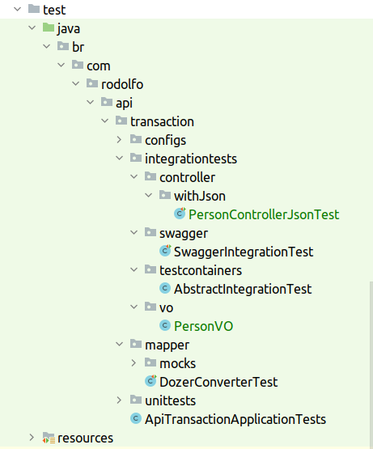

 _/home/ubuntu20/dev/workspace/lab/rest-SpringBoot/api-transaction → diretorio na maquina
 https://github.com/rodolfoSantosBR/rest-SpringBoot   → Git
 https://www.udemy.com/course/restful-apis-do-0-a-nuvem-com-springboot-e-docker/learn/lecture/32559808#questions → curso
 Arquivo principal aws_docker_spring.adoc_

PRA ESSE PROJETO E PRECISO RODAR:

docker run -p 3309:3306 -e MYSQL_ALLOW_EMPTY_PASSWORD=yes mysql:8.0.29

|===
| Tema | Branch

| Tratar erros
| aws_docker-spring

| Injecao de dependencia
| aws_docker-spring/injecaoDependencia

| Injecao de dependencia
| aws_docker-spring/injecaoDependencia

eu achava que era de outra r3a vpn pra mim por enauqnto nao chega a impactar sdsadsasds
| Banco de dados
| aws_docker-spring/injecaoDependencia

| Teste unitario com Mockito
| aws_docker_spring/testeUnitarioMockito

|===

*__ Tratar erros__*

Primeiro cria :

1 - ExceptionResponse
2 - UnsuportedMethodOperationException
3 - CustomizeResponseEntityExceptionHandler

*__Injecao de Dependencia __*

Foi criado a injecao de dependencia no PersonController com o uso de PersonServices

Trabalhando com banco de dados H2

Feita a configuracao no pom.xml e no yml
basta acessar a url http:localhost:8089/h2-console

*_Banco de dados_*

Body Usado para criar Person

{

    "firstName" : "Leonardo",
    "lastName"  : "da Vinci",
    "address" : "Anchiano - Italy",
    "gender" : "Male"

}

*_Trabalhando com flyway_*

Referencia:  Secao 11 -
https://www.udemy.com/course/restful-apis-do-0-a-nuvem-com-springboot-e-docker/learn/lecture/32575918#questions

1) Basta adicionar as dependencias no pom.xml e o plugin apontando pro banco.

2) Criar a estrutura no diretorio como na figura abaixo.

image::img/image-2023-01-28-10-17-08-415.png[]

*_Open API_*

http://localhost:8089/microservicos/api-docs
http://localhost:8089/swagger-ui/index.html

*_Teste unitario com Mockito_*

 --

*_Teste de integracao_*

docker image pull mysql:8.0.29
docker run -p 3309:3306 -e MYSQL_ALLOW_EMPTY_PASSW0ORD=yes mysql:8.0.29

*_CORS_*

Habilitando CORS no Spring :

 Na classe PersonController ;

  @CrossOrigin(origins = {"http://localhost:8888", "htts://erudio.com.br" } )
    public Person create(@RequestBody Person person) {
        return service.create(person);
    }

  *Fazendo teste de integracao do CORS:*
 Criando a classe PersonControllerJsonTest;

 // Vai desabilitar falha quando vierem campos existentes no Json
        objectMapper.disable(DeserializationFeature.FAIL_ON_UNKNOWN_PROPERTIES);

 Classe de teste

 @SpringBootTest(webEnvironment = SpringBootTest.WebEnvironment.DEFINED_PORT)
 @TestMethodOrder(MethodOrderer.OrderAnnotation.class)
 public class PersonControllerJsonTest extends AbstractIntegrationTest {

    private static RequestSpecification specification;

    private static ObjectMapper objectMapper;

    private static PersonVO person;

    @BeforeAll
    public static void setup() {

        objectMapper = new ObjectMapper();

        // Vai desabilitar falha quando vierem campos existentes no Json
        objectMapper.disable(DeserializationFeature.FAIL_ON_UNKNOWN_PROPERTIES);
        person = new PersonVO();

    }

    @Test
    @Order(1)
    public void testCreate() throws JsonProcessingException {

        mockPerson();

        // Deve ficar aqui porque beforeAll nao pega o contexto do Spring
        specification = new RequestSpecBuilder()
                .addHeader(TestConfigs.HEADER_PARAM_ORIGIN, "https://erudio.com.br")
                .setBasePath("/person")
                .setPort(TestConfigs.SERVER_PORT)
                .addFilter(new RequestLoggingFilter(LogDetail.ALL))
                .addFilter(new ResponseLoggingFilter(LogDetail.ALL))
                .build();

        var content =
                given().spec(specification)
                        .contentType(TestConfigs.CONTENT_TYPE_JSON)
                        .body(person)
                        .when()
                        .post()
                        .then()
                        .statusCode(200)
                        .extract()
                        .body()
                        .asString();

        PersonVO createdPerson = objectMapper.readValue(content, PersonVO.class);
        person = createdPerson ;

        assertNotNull(person.getId());
        assertNotNull(person.getFirstName());
        assertTrue(createdPerson.getId() > 0);

        assertEquals("Richard", createdPerson.getFirstName());

    }

    private void mockPerson() {
        person.setFirstName("Richard");
        person.setLastName("Stallment");
        person.setAddress("Nova York");
        person.setGender("Male");

    }

 }

 Estrutura das classes:

 *Testando com diferente origins*

Em alguns dos testes dev ter erros.

    @Test
    @Order(4)
    public void testFindByIdWithWrongOrigin() throws JsonMappingException, JsonProcessingException {
        mockPerson();

        specification = new RequestSpecBuilder()
                .addHeader(TestConfigs.HEADER_PARAM_ORIGIN, TestConfigs.ORIGIN_SEMERU)
                .setBasePath("/person")
                .setPort(TestConfigs.SERVER_PORT)
                .addFilter(new RequestLoggingFilter(LogDetail.ALL))
                .addFilter(new ResponseLoggingFilter(LogDetail.ALL))
                .build();

        var content = given().spec(specification)
                .contentType(TestConfigs.CONTENT_TYPE_JSON)
                .pathParam("id", person.getId())
                .when()
                .get("{id}")
                .then()
                .statusCode(403)
                .extract()
                .body()
                .asString();

        assertNotNull(content);
        assertEquals("Invalid CORS request", content);
    }

