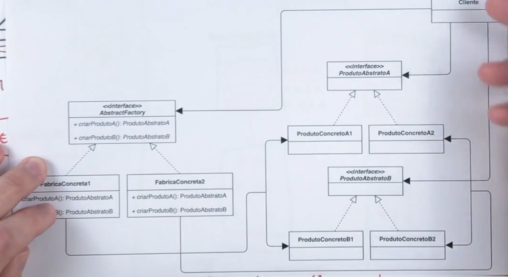

*__ Abstract Factory  __*

 Estrutura do Padrao Abstract Factory

Fornece uma interface para criar FAMILIA DE OBJETOS RELACIONADOS
ou DEPENDENTES sem especificar suas classes concretas

 Estrutura das interfaces para esse exemplo, no exemplo abaixo
temos as familias de cada objeto:

Evoluindo a implementacao das classes:

Diagrama generico de um padrao Abstract Factory

Quando um sistema deve ser configurado com uma dentre multiplas familias de produtos.

Quando  uma familia de objetos relacionados foram projetados para trabalhar em conjunto.

Quando se deseja fornecer uma biblioteca de produtos e se deseja revelar para o cliente
somente as interfaces e nao suas implementacoes

Estrutura do codigo:

