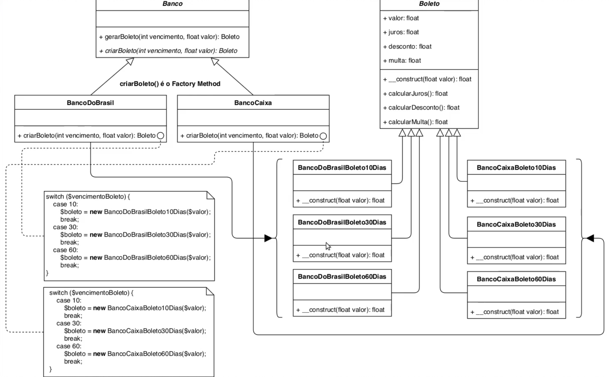
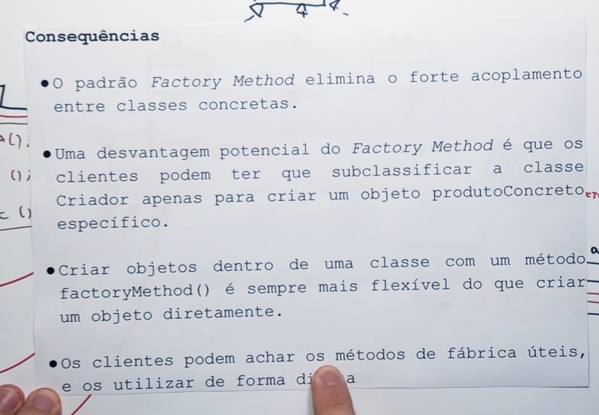

*__ Factory Method__*

 Define uma interface para criacao do Objeto, mas as subclasses podem decidir qual classe instanciar.

Factory Method Generico:

Quando utilizar:

1 - Banco nao sabe qual classe ele vai instanciar

Consequencias de usar o factory Method:

